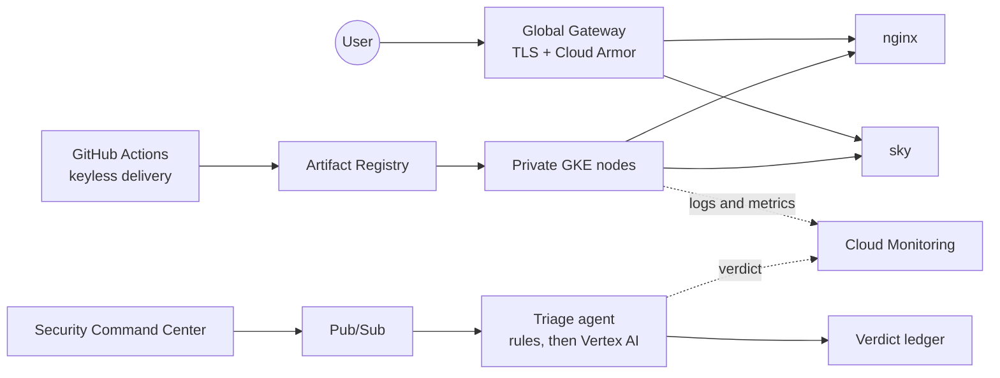

  

  
  

  <strong>Cloud infrastructure and identity.</strong> 
  Architecture decisions, measured behaviour, failure drills, trade-offs and the things that broke.

  
  
  
  
  
  
  

---

## Latest project

<h3 align="center">Kubernetes platform: Built, tested, secured and validated</h3>

  
  
  

A private GKE cluster hosting public workloads, and an AI agent that triages security findings. It ran at sindrg.com from late August until 25 September 2026, when I shut it down. The repo still has the Terraform, the decisions, a worklog for every phase and the [final screenshots](https://github.com/sindredg/k8-lab/blob/main/worklog/shutdown.md).

  

<table>
  <tr>
    <td align="center"><strong>125 rps</strong> 8 Pods, no failures</td>
    <td align="center"><strong>394 ms</strong> p95 under load</td>
    <td align="center"><strong>70.5 s</strong> median deploy</td>
    <td align="center"><strong>0</strong> rollout connection failures, from 72</td>
  </tr>
  <tr>
    <td align="center"><strong>7 of 7</strong> holdout findings right every run, rules alone 5</td>
    <td align="center"><strong>0</strong> false contradictions in 125 runs, from 15</td>
    <td align="center"><strong>~2 s</strong> p95 per model call</td>
    <td align="center"><strong>0</strong> critical or high in the frontend image, from 17</td>
  </tr>
</table>

<strong>What was inside</strong>

 

<table>
  <tr>
    <td width="33%"><strong>Platform</strong> Private nodes, custom VPC, Cloud NAT, Gateway API, managed TLS and autoscaling across three zones.</td>
    <td width="33%"><strong>Delivery</strong> Keyless federation, immutable images, required checks, gated rollouts and automated upstream pin updates.</td>
    <td width="33%"><strong>Security and operations</strong> Pod Security, default-deny networking, Cloud Armor, observability, failure drills and a measured threat model.</td>
  </tr>
  <tr>
    <td colspan="3"><strong>AI triage</strong> in <a href="https://github.com/sindredg/ai-k8s">ai-k8s</a> Security Command Center findings over Pub/Sub to a worker with four scoped grants. The model can never accept a finding, a contradiction must land on a control that applies, every verdict is written to an append-only ledger before anyone is told, and every failure path was drilled.</td>
  </tr>
</table>

  <code>Terraform</code>&nbsp; <code>GKE</code>&nbsp; <code>Kubernetes</code>&nbsp;
  <code>Gateway API</code>&nbsp; <code>Cloud Armor</code>&nbsp;
  <code>Workload Identity Federation</code>&nbsp; <code>GitHub Actions</code>&nbsp; <code>k6</code>&nbsp;
  <code>Security Command Center</code>&nbsp; <code>Vertex AI</code>&nbsp; <code>Go</code>

---

## Project map

The rest of the work is grouped by the problem it explores. The larger labs include build notes,
architecture decisions, validation evidence and troubleshooting records.

| Area | Projects |
| --- | --- |
| **Identity across clouds** | [Entra ID to AWS IAM Identity Center](https://github.com/sindredg/cross-cloud-entra-aws) · [Two-site AD DS synced to Entra ID](https://github.com/sindredg/two-site-hybrid-identity) |
| **Identity governance** | [Conditional Access, PIM and access reviews](https://github.com/sindredg/Access-Control-and-Identity-Governance) · [OIDC SSO and SCIM for Grafana](https://github.com/sindredg/entra-app-roles-sso-scim) |
| **Azure platforms** | [Hub-and-spoke with cross-premises connectivity](https://github.com/sindredg/hybrid-network-az) · [Azure Container Apps platform](https://github.com/sindredg/container-app-in-azure) |
| **Applications and access** | [Sky](https://github.com/sindredg/sky) · [OAuth 2.0 and token claims in .NET 8](https://github.com/sindredg/app-registrations-and-JWT-tokens) · [Least-privilege Azure MCP access](https://github.com/sindredg/claude-azure-mcp-rbac-design) |

---

  

