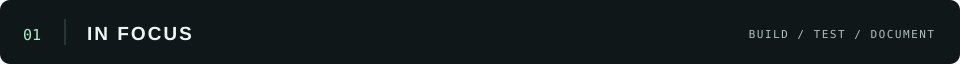
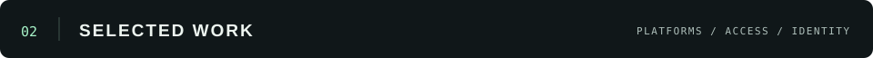

  <a href="#featured-project">In focus</a> &nbsp; · &nbsp;
  <a href="#more-projects">Selected work</a> &nbsp; · &nbsp;
  <a href="https://github.com/sindredg?tab=repositories">All repositories ↗</a>

Cloud platforms and the identity systems around them. Real deployments, architecture decisions, failure drills, and the things that broke.

 

<!-- Editing guide: docs/updating-profile.md. All project content is inside the marked blocks. -->

<h2></h2>

<!-- FEATURED:START — Replace this whole block to switch the main project. -->
<table>
<tr><td>
 
COMPLETED LAB &nbsp; / &nbsp; GOOGLE CLOUD + KUBERNETES
<h2>Kubernetes platform &amp; AI security triage</h2>

A private GKE cluster serving public workloads. Keyless delivery, measured rollouts, failure drills, and an AI agent that triages security findings.

<a href="https://github.com/sindredg/k8-lab"><strong>Explore the project ↗</strong></a> &nbsp; · &nbsp; <a href="https://github.com/sindredg/k8-lab/blob/main/decisions.md">Decisions</a> &nbsp; · &nbsp; <a href="https://github.com/sindredg/k8-lab/tree/main/worklog">Worklogs</a>

Ran at sindrg.com from August to 25 September 2026. Infrastructure shut down; code, worklogs, and evidence preserved.

</td></tr>
</table>

<table>
<tr>
<td width="33%" align="center"><h2>125 req/s</h2>8 PODS · NO FAILURES  </td>
<td width="33%" align="center"><h2>70.5 s</h2>MEDIAN DEPLOYMENT  </td>
<td width="33%" align="center"><h2>72 → 0</h2>ROLLOUT CONNECTION FAILURES  </td>
</tr>
</table>

<code>Terraform</code> <code>GKE</code> <code>GitHub Actions</code> <code>Cloud Armor</code> <code>Vertex AI</code> <code>Go</code>

<strong>Under the hood</strong> — platform, delivery, and AI triage

- **Platform:** private nodes, custom VPC, Cloud NAT, Gateway API, managed TLS, and autoscaling across three zones.
- **Delivery & operations:** keyless federation, immutable images, gated rollouts, default-deny networking, Cloud Armor, and failure drills.
- **[AI triage](https://github.com/sindredg/ai-k8s):** Security Command Center findings flow through Pub/Sub to a worker with four scoped grants. Rules run before Vertex AI; verdicts go to an append-only ledger.

<!-- FEATURED:END -->

 

<h2></h2>

<!-- SELECTED:START — Each td is one card. Keep two cards per tr, or use colspan="2" for one full-width card. -->
<table>
<tr>
<td width="50%" valign="top">

<h3><a href="https://github.com/sindredg/cross-cloud-entra-aws">Entra ID → AWS ↗</a></h3>

Workforce identity across clouds. Federation, SCIM provisioning, and governed access to AWS.

ENTRA ID &nbsp; / &nbsp; AWS &nbsp; / &nbsp; TERRAFORM  
</td>
<td width="50%" valign="top">

<h3><a href="https://github.com/sindredg/hybrid-network-az">Azure hybrid networking ↗</a></h3>

Hub-and-spoke networking with an encrypted cross-premises tunnel, private endpoints, and two-way DNS.

AZURE &nbsp; / &nbsp; VPN &nbsp; / &nbsp; PRIVATE LINK  
</td>
</tr>
<tr>
<td width="50%" valign="top">

<h3><a href="https://github.com/sindredg/two-site-hybrid-identity">Two sites. One identity. ↗</a></h3>

A two-site Active Directory forest synced to Entra ID, with hybrid endpoints and policy-enforced security baselines.

AD DS &nbsp; / &nbsp; ENTRA ID &nbsp; / &nbsp; POWERSHELL  
</td>
<td width="50%" valign="top">

<h3><a href="https://github.com/sindredg/container-app-in-azure">Azure Container Apps ↗</a></h3>

A public web tier and private API, with passwordless image pulls, scale-to-zero, and automated delivery.

TERRAFORM &nbsp; / &nbsp; CONTAINERS &nbsp; / &nbsp; CI/CD  
</td>
</tr>
</table>
<!-- SELECTED:END -->

<!-- ARCHIVE:START — One Markdown bullet per project. Add, remove, or reorder freely. -->

<strong>More from the workbench ↗</strong>

- **[AI security triage](https://github.com/sindredg/ai-k8s)** — Rules, scoped model access, and an auditable verdict ledger for cloud security findings.
- **[Identity governance](https://github.com/sindredg/Access-Control-and-Identity-Governance)** — Conditional Access, just-in-time administration with PIM, and access reviews.
- **[Grafana SSO & provisioning](https://github.com/sindredg/entra-app-roles-sso-scim)** — OIDC sign-in, app-role mapping, and a custom SCIM bridge.
- **[Sky](https://github.com/sindredg/sky)** — An application deployed on the Kubernetes platform.
- **[OAuth 2.0 in .NET](https://github.com/sindredg/app-registrations-and-JWT-tokens)** — API authorization through scopes, app roles, groups, and token claims.
- **[Azure MCP & RBAC](https://github.com/sindredg/claude-azure-mcp-rbac-design)** — Scoped, read-only Azure access for Claude, enforced through Azure RBAC.

<!-- ARCHIVE:END -->

 

---

BUILD IT. &nbsp; TEST IT. &nbsp; WRITE IT DOWN.

