  

  
  
  

---

### About

I design, build and run cloud infrastructure and identity platforms.

> Everything below is built and tested in a real environment, and written up as I go:
> how it was put together, why it is shaped the way it is, what the trade-offs were,
> and what broke along the way.

### Toolbox

  
  
  
  
  
  
  
  
  
  

---

### Projects

Click a project to open it.

<b>Kubernetes Platform on GKE</b> &nbsp;·&nbsp; Kubernetes on GKE, running on my own domain &nbsp;live

 

A secure and reliable Kubernetes platform hosting web applications on a custom domain: private VPC,
keyless delivery, Gateway API with managed TLS, Pod Security, NetworkPolicies, HPA, monitoring and
failure drills. Still adding to it.

Terraform · GCP · GKE · Kubernetes · Gateway API · Artifact Registry · Workload Identity Federation · GitHub Actions

[Repository](https://github.com/sindredg/k8-lab) &nbsp;·&nbsp; [Live at sindrg.com](https://sindrg.com)

<b>Cross-cloud identity: Entra ID to AWS</b> &nbsp;·&nbsp; Entra ID as the identity source for AWS

 

Entra ID as identity source for AWS. SAML federation and SCIM provisioning to AWS IAM Identity Center,
attribute-based security group and JML workflows. Terraform builds an isolated VPC where Grafana runs
on ECS, reached over Entra Private Access.

Terraform · AWS IAM Identity Center · Entra ID · Private Access · Lifecycle Workflows · SAML · SCIM · Bicep · MS Graph · Grafana · ECS Fargate

[Repository](https://github.com/sindredg/cross-cloud-entra-aws)

<b>Azure Hub-and-Spoke with Cross-Premises Connectivity</b> &nbsp;·&nbsp; Azure joined to an on-prem datacenter over IPsec

 

Hub-and-spoke network in Azure joined to a simulated on-premises datacenter in another region over an
encrypted IPsec tunnel, built one mechanism at a time. Gateway transit, subnet NSGs, Bastion access,
forced routing through Azure Firewall, Key Vault behind a private endpoint, and two-way DNS across the
tunnel.

Terraform · Azure Networking · VPN Gateway · Hub-and-Spoke · CI/CD · GitHub Actions · OIDC · Azure RBAC

[Repository](https://github.com/sindredg/hybrid-network-az)

<b>Azure Container Platform</b> &nbsp;·&nbsp; a public web tier and an API with no public address

 

A public web tier and an internal API on Azure Container Apps, deployed with Terraform. The API has no
public address. Passwordless managed-identity image pulls, health probes, revisions, scale-to-zero,
remote state with locking, centralised logging and automated delivery.

Terraform · Azure Container Apps · ACR · Managed Identity · CI/CD · Docker · Nginx · Python/FastAPI

[Repository](https://github.com/sindredg/container-app-in-azure)

<b>Hybrid identity: AD DS synced to Entra ID</b> &nbsp;·&nbsp; a two-site AD forest synced to Entra ID

 

Two-site Active Directory forest in Azure, synchronized with Entra ID. Features hybrid-joined endpoints
and users, per-machine LAPS credentials, policy-enforced tiered privileged access, and private networks.
Built throughout with Terraform and idempotent PowerShell.

Terraform · Azure · Entra ID · Active Directory · Windows Server · Group Policy · Windows LAPS · PowerShell · Entra Connect Sync · GitHub Actions

[Repository](https://github.com/sindredg/two-site-hybrid-identity)

<b>Access Control &amp; Identity Governance</b> &nbsp;·&nbsp; Conditional Access, PIM and access reviews

 

Governs tenant-wide access and access to in-house applications with Entra ID: Conditional Access,
just-in-time administration with PIM, entitlement management and access reviews.

Entra ID · Conditional Access · PIM · FIDO2 · Access Reviews · SSO · SCIM · Microsoft Graph PowerShell

[Repository](https://github.com/sindredg/Access-Control-and-Identity-Governance)

<b>SSO + SCIM for a Self-Hosted App</b> &nbsp;·&nbsp; OIDC sign-in and SCIM provisioning for Grafana

 

Implements the workforce identity lifecycle for self-hosted Grafana: Entra ID as the identity provider,
OpenID Connect SSO with app-role mapping, and SCIM provisioning through a custom bridge.

OpenID Connect · SSO · SCIM · Grafana · App Roles · Azure IaaS · Docker

[Repository](https://github.com/sindredg/entra-app-roles-sso-scim)

<b>Securing AI with MCP Server and RBAC</b> &nbsp;·&nbsp; read-only Azure access for Claude, scoped with RBAC

 

Gives Claude scoped, read-only access to Azure through the Azure MCP Server, with Azure RBAC as the
authoritative control and host/server hardening as defense in depth.

Azure MCP Server · Azure RBAC · Service Principal · Claude

[Repository](https://github.com/sindredg/claude-azure-mcp-rbac-design)

<b>Apps, APIs &amp; Access Tokens: OAuth 2.0 in .NET 8</b> &nbsp;·&nbsp; scopes, app roles and token claims in .NET 8

 

Builds an Entra ID authorization chain with a protected API and web and daemon clients. Access is
modeled through scopes, app roles and groups, then enforced from token claims in a .NET 8 API.

.NET 8 · OAuth 2.0 · OpenID Connect · App Roles · App Registrations · Application Permissions

[Repository](https://github.com/sindredg/app-registrations-and-JWT-tokens)

---

  

