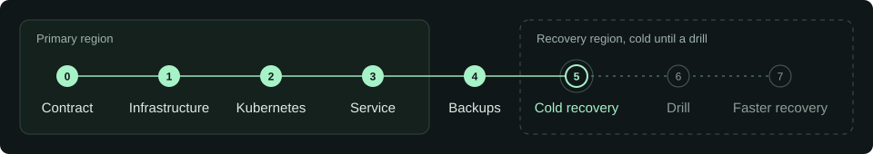

  <a href="#in-progress">In progress</a> &emsp;&emsp;
  <a href="#featured-project">Featured project</a> &emsp;&emsp;
  <a href="#more-projects">Selected work</a> &emsp;&emsp;
  <a href="https://github.com/sindredg?tab=repositories">All repositories</a>

Cloud platforms and the identity systems around them. Build notes, architecture decisions, testing, and troubleshooting.

 

<!-- Editing guide: docs/updating-profile.md. All project content is inside the marked blocks. -->

<h2></h2>

<!-- IN-PROGRESS:START. Replace or delete this whole block. Regenerate assets/k8s-dr-progress.svg when a milestone completes. -->
<h3><a href="https://github.com/sindredg/k8s-dr">Kubernetes disaster recovery</a></h3>

Recovering a stateful service after losing a whole region. Gitea and PostgreSQL run on a kubeadm cluster built on VMs. A drill rebuilds the cluster from code in a second region, restores an offsite backup, and measures downtime and data loss.

Five of eight milestones complete. Hourly, encrypted offsite backups restore in under a minute. Next: cold recovery in a second region.

<a href="https://github.com/sindredg/k8s-dr"><strong>Follow the project</strong></a> &emsp; <a href="https://github.com/sindredg/k8s-dr/blob/main/plan.md">Plan</a> &emsp; <a href="https://github.com/sindredg/k8s-dr/tree/main/docs/decisions">Decisions</a> &emsp; <a href="https://github.com/sindredg/k8s-dr/tree/main/docs/worklogs">Worklogs</a>

<code>Google Cloud</code> <code>Terraform</code> <code>Ansible</code> <code>kubeadm</code> <code>Flux</code> <code>SOPS</code> <code>PostgreSQL</code> <code>Gitea</code>

<!-- IN-PROGRESS:END -->

 

<h2></h2>

<!-- FEATURED:START. Replace this whole block to switch the main project. -->
<table>
<tr><td colspan="3">
 
Completed lab on Google Cloud
<h2>Kubernetes platform &amp; AI security triage</h2>

A private GKE cluster serving public workloads. Keyless delivery, measured rollouts, failure drills, and an AI agent that triages security findings.

<a href="https://github.com/sindredg/k8-lab"><strong>Explore the project</strong></a> &emsp; <a href="https://github.com/sindredg/k8-lab/blob/main/decisions.md">Decisions</a> &emsp; <a href="https://github.com/sindredg/k8-lab/tree/main/worklog">Worklogs</a> &emsp; <a href="https://github.com/sindredg/k8-lab/blob/main/worklog/shutdown.md">Shutdown notes</a>

Infrastructure retired in September 2026; code, worklogs, and validation notes remain.

</td></tr>
<tr>
<td width="33%" valign="top"><strong>125 req/s</strong> across 8 Pods with no failures</td>
<td width="33%" valign="top"><strong>70.5 s</strong> median deployment time</td>
<td width="33%" valign="top"><strong>72 to 0</strong> connection failures during rollouts</td>
</tr>
</table>

<code>Terraform</code> <code>GKE</code> <code>GitHub Actions</code> <code>Cloud Armor</code> <code>Vertex AI</code> <code>Go</code>

<strong>Under the hood:</strong> platform, delivery, and AI triage

- **Platform:** private nodes, custom VPC, Cloud NAT, Gateway API, managed TLS, and autoscaling across three zones.
- **Delivery & operations:** keyless federation, immutable images, gated rollouts, default-deny networking, Cloud Armor, and failure drills.
- **[AI triage](https://github.com/sindredg/ai-k8s):** Security Command Center findings flow through Pub/Sub to a worker with four scoped grants. Rules run before Vertex AI; verdicts go to an append-only ledger.

<!-- FEATURED:END -->

 

<h2></h2>

<!-- SELECTED:START. Each td is one card. Keep two cards per tr, or use colspan="2" for one full-width card. -->
<table>
<tr>
<td width="50%" valign="top">

<h3><a href="https://github.com/sindredg/cross-cloud-entra-aws">Entra ID → AWS</a></h3>

Workforce identity across clouds. Federation, SCIM provisioning, and governed access to AWS.

Entra ID, AWS, Terraform  
</td>
<td width="50%" valign="top">

<h3><a href="https://github.com/sindredg/hybrid-network-az">Azure hybrid networking</a></h3>

Hub-and-spoke networking with an encrypted cross-premises tunnel, private endpoints, and two-way DNS.

Azure, VPN, Private Link  
</td>
</tr>
<tr>
<td width="50%" valign="top">

<h3><a href="https://github.com/sindredg/two-site-hybrid-identity">Two-site hybrid identity</a></h3>

A two-site Active Directory forest synced to Entra ID, with hybrid endpoints and policy-enforced security baselines.

AD DS, Entra ID, PowerShell  
</td>
<td width="50%" valign="top">

<h3><a href="https://github.com/sindredg/container-app-in-azure">Azure Container Apps</a></h3>

A public web tier and private API, with passwordless image pulls, scale-to-zero, and automated delivery.

Terraform, containers, CI/CD  
</td>
</tr>
</table>
<!-- SELECTED:END -->

<!-- ARCHIVE:START. One Markdown bullet per project. Add, remove, or reorder freely. -->

<strong>Other projects</strong>

- **[AI security triage](https://github.com/sindredg/ai-k8s)**: Rules, scoped model access, and an auditable verdict ledger for cloud security findings.
- **[Identity governance](https://github.com/sindredg/Access-Control-and-Identity-Governance)**: Conditional Access, just-in-time administration with PIM, and access reviews.
- **[Grafana SSO & provisioning](https://github.com/sindredg/entra-app-roles-sso-scim)**: OIDC sign-in, app-role mapping, and a custom SCIM bridge.
- **[Sky](https://github.com/sindredg/sky)**: An application deployed on the Kubernetes platform.
- **[OAuth 2.0 in .NET](https://github.com/sindredg/app-registrations-and-JWT-tokens)**: API authorization through scopes, app roles, groups, and token claims.
- **[Azure MCP & RBAC](https://github.com/sindredg/claude-azure-mcp-rbac-design)**: Scoped, read-only Azure access for Claude, enforced through Azure RBAC.

<!-- ARCHIVE:END -->

 

---

Notes on building and testing cloud infrastructure.

