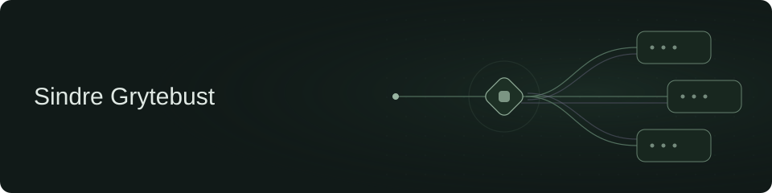

  
  &nbsp;
  

Cloud platforms and the identity systems around them. Build notes, architecture decisions, testing, and troubleshooting.

 

<!-- Editing guide: docs/updating-profile.md. All project content is inside the marked blocks. -->

<h2></h2>

<!-- SELECTED:START. Each td is one card. Keep two cards per tr, or use colspan="2" for one full-width card. -->
<table>
<tr>
<td width="50%" valign="top">

<h3><a href="https://github.com/sindredg/k8s-dr">Kubernetes disaster recovery</a></h3>

Recovering a stateful service after losing a region. Three drills rebuilt a kubeadm cluster from code in a second region and restored an offsite backup in under 20 minutes.

Google Cloud, Terraform, Ansible, Flux  
</td>
<td width="50%" valign="top">

<h3><a href="https://github.com/sindredg/k8-lab">Kubernetes platform</a></h3>

A private GKE cluster serving public workloads, with keyless delivery, measured rollouts, failure drills, and an AI agent that triages security findings.

GKE, Terraform, GitHub Actions  
</td>
</tr>
<tr>
<td width="50%" valign="top">

<h3><a href="https://github.com/sindredg/cross-cloud-entra-aws">Entra ID → AWS</a></h3>

Workforce identity across clouds. Federation, SCIM provisioning, and governed access to AWS.

Entra ID, AWS, Terraform  
</td>
<td width="50%" valign="top">

<h3><a href="https://github.com/sindredg/hybrid-network-az">Azure hybrid networking</a></h3>

Hub-and-spoke networking with an encrypted cross-premises tunnel, private endpoints, and two-way DNS.

Azure, VPN, Private Link  
</td>
</tr>
<tr>
<td width="50%" valign="top">

<h3><a href="https://github.com/sindredg/two-site-hybrid-identity">Two-site hybrid identity</a></h3>

A two-site Active Directory forest synced to Entra ID, with hybrid endpoints and policy-enforced security baselines.

AD DS, Entra ID, PowerShell  
</td>
<td width="50%" valign="top">

<h3><a href="https://github.com/sindredg/container-app-in-azure">Azure Container Apps</a></h3>

A public web tier and private API, with passwordless image pulls, scale-to-zero, and automated delivery.

Terraform, containers, CI/CD  
</td>
</tr>
</table>
<!-- SELECTED:END -->

<!-- ARCHIVE:START. One Markdown bullet per project. Add, remove, or reorder freely. -->

<strong>Other projects</strong>

- **[AI security triage](https://github.com/sindredg/ai-k8s)**: Rules, scoped model access, and an auditable verdict ledger for cloud security findings.
- **[Identity governance](https://github.com/sindredg/Access-Control-and-Identity-Governance)**: Conditional Access, just-in-time administration with PIM, and access reviews.
- **[Grafana SSO & provisioning](https://github.com/sindredg/entra-app-roles-sso-scim)**: OIDC sign-in, app-role mapping, and a custom SCIM bridge.
- **[Sky](https://github.com/sindredg/sky)**: An application deployed on the Kubernetes platform.
- **[OAuth 2.0 in .NET](https://github.com/sindredg/app-registrations-and-JWT-tokens)**: API authorization through scopes, app roles, groups, and token claims.
- **[Azure MCP & RBAC](https://github.com/sindredg/claude-azure-mcp-rbac-design)**: Scoped, read-only Azure access for Claude, enforced through Azure RBAC.

<!-- ARCHIVE:END -->

 

---

Notes on building and testing cloud infrastructure.

